# Visualización del Autómata LR(1)

Este archivo genera automáticamente el grafo del autómata LR(1) usando Mermaid.

## Ejemplo: Gramática S -> C C | C -> c C | d


## Leyenda

- 🔵 **Estado inicial** (I0)
- 🟢 **Estados de aceptación** (I1, I5)
- 🟡 **Estados intermedios** (con items no completos)
- 🟠 **Estados de reducción** (items completos)

---

## Cómo generar el grafo de tu gramática

### Opción 1: Usar el programa Java

1. Ejecuta `ejecutar.bat`
2. Ingresa tu gramática
3. Click en "Construir LR(1)"
4. Ve a la pestaña "Grafo" para visualización interactiva

### Opción 2: Generar código Mermaid automáticamente

Agrega este método a `LR1Parser.java`:

```java
// Genera codigo Mermaid para visualizar el grafo
public static String generateMermaidGraph(LR1Result result) {
    StringBuilder sb = new StringBuilder();
    sb.append("```mermaid\n");
    sb.append("graph TD\n");
    
    // Definir nodos
    for (int i = 0; i < result.states.size(); i++) {
        sb.append("    I").append(i).append("[\"<b>I").append(i).append("</b>");
        
        List<ItemLR1> items = result.states.get(i);
        for (ItemLR1 item : items) {
            String itemStr = item.toString()
                .replace("->", "→")
                .replace(".", "•");
            sb.append("<br/>").append(itemStr);
        }
        
        sb.append("\"]\n");
    }
    
    sb.append("\n");
    
    // Definir transiciones
    for (Map.Entry<String, String> entry : result.transitions.entrySet()) {
        String[] parts = entry.getKey().split("-");
        String src = parts[0];
        String symbol = parts[1];
        String dst = entry.getValue();
        
        sb.append("    I").append(src)
          .append(" -->|").append(symbol).append("| I")
          .append(dst).append("\n");
    }
    
    sb.append("\n");
    
    // Estilos
    sb.append("    style I0 fill:#e3f2fd\n");
    for (int i = 0; i < result.states.size(); i++) {
        for (ItemLR1 item : result.states.get(i)) {
            if (item.lhs.endsWith("'") && item.dot == item.rhs.size()) {
                sb.append("    style I").append(i).append(" fill:#c8e6c9\n");
                break;
            }
        }
    }
    
    sb.append("```\n");
    return sb.toString();
}
```

### Opción 3: Ver en GitHub

1. Sube el archivo `GRAFO_LR1.md` a tu repositorio
2. GitHub renderizará automáticamente el diagrama Mermaid
3. Se verá profesional y animado

---

## Ejemplo: Gramática con operadores (E -> E + T | T, T -> id)

```mermaid
graph TD
    I0["<b>I0</b><br/>E' → •E, $<br/>E → •E + T, $<br/>E → •T, $<br/>T → •id, +/$"]
    I1["<b>I1</b><br/>E' → E•, $<br/>E → E•+ T, $"]
    I2["<b>I2</b><br/>E → T•, +/$"]
    I3["<b>I3</b><br/>T → id•, +/$"]
    I4["<b>I4</b><br/>E → E +•T, $<br/>T → •id, $"]
    I5["<b>I5</b><br/>E → E + T•, $"]
    I6["<b>I6</b><br/>T → id•, $"]
    
    I0 -->|E| I1
    I0 -->|T| I2
    I0 -->|id| I3
    I1 -->|+| I4
    I4 -->|T| I5
    I4 -->|id| I6
    
    style I0 fill:#e3f2fd
    style I1 fill:#c8e6c9
    style I2 fill:#ffccbc
    style I3 fill:#ffccbc
    style I4 fill:#fff9c4
    style I5 fill:#ffccbc
    style I6 fill:#ffccbc
```



---

## Ventajas de usar Mermaid

✅ **Renderizado automático** en GitHub, VS Code, GitLab
✅ **Fácil de compartir** - solo texto markdown
✅ **Profesional** - se ve limpio y organizado
✅ **Interactivo** - algunos viewers permiten zoom
✅ **Versionable** - se guarda en Git como texto

---

## Herramientas para ver Mermaid

1. **GitHub/GitLab** - Renderizado automático
2. **VS Code** - Extensión "Markdown Preview Mermaid Support"
3. **Mermaid Live Editor** - https://mermaid.live
4. **Obsidian** - Soporte nativo
5. **Notion** - Bloques de código Mermaid

---

**Tip:** Para ver este archivo con los diagramas renderizados, ábrelo en GitHub o usa una extensión de Markdown en VS Code.
